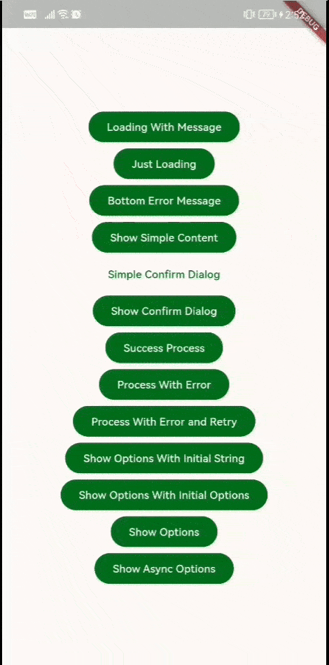

## KDialogs

Implementation of common, useful dialogs for displaying loading indicators, confirmation messages, content, error messages, and more. This README provides an overview of the project.
- Strives to adhere to the design principles defined in Material 3.
### Implementations:
*  showKDialogWithLoadingMessage:

    Displays a spinner with message and provides a function to stop the indicator.
    ```dart
        final close = await showKDialogWithLoadingMessage(context,message: "Loading Please Wait...");
        await Future.delayed(const Duration(seconds: 2));
        close();
    ```

*  showKDialogWithLoadingIndicator:

    Displays a spinner and provides a function to stop the indicator.
    ```dart
        final close = await showKDialogWithLoadingIndicator(context)
        await Future.delayed(const Duration(seconds: 2));
        close();
    ```

*  showBottomAlertKDialog:

    Displays a bottom modal that can show an error message, along with an option to retry, which returns a boolean 'true' if the retry action is taken.
    ```dart
        await showBottomAlertKDialog(context, message: "This is an error message", retryable: true);
    ```

*  showKDialogContent:

    Enables the display of content within a dialog and provides various additional operations.
    ```dart
       await showKDialogContent(
                context,
                closeOnOutsideTab: false,
                builder: (context) {
                return Column(
                    children: [
                    const Text("Hello there!!!"),
                    Container(
                        color: Colors.green,
                        width: 100.0,
                        height: 100.0,
                    )
                    ],
                );
                },
            );
    ```
*  showConfirmationKDialog:

    Displays a dialog with the option to cancel or accept, returning 'true' if the accept option is chosen.
    ```dart
      final response = await showConfirmationKDialog(context, title: "Confirm Message");
    ```
*  showAsyncProgressKDialog:

   Combines the various dialog implementations, enabling the ability to request confirmation, display loading indicators, show error dialogs, and present the retry option.
    ```dart
        // simple
     final resultvalue = await showAsyncProgressKDialog<String>(
                context,
                doProcess: () async {
                    await Future.delayed(const Duration(seconds: 2)); // process
                    return "value";
                    },
                showSuccessSnackBar: true,
            );

    // retryable and  confirmationRequired
    final resultvalue = await showAsyncProgressKDialog<String>(
                context,
                doProcess: () async {
                    await Future.delayed(const Duration(seconds: 2));
                    throw "This is an error indicating that the process could not be completed";
                },
                confirmationRequired: true,
                showSuccessSnackBar: true,
                loadingMessage: "Procesing...",
                retryable: true,
            );
    ```

Examples:


